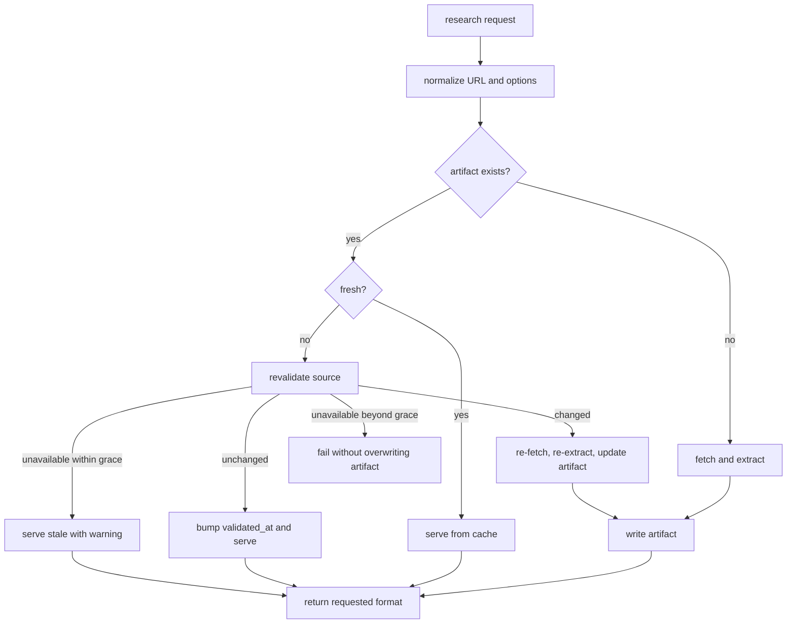

# Research Cache Contract

This document captures the expected data and freshness behavior before implementation tickets are written.

## Command Contract Draft

Initial command shape:

```bash
forward-nexus research <url> \
  --topic "React docs" \
  --tags react --tags hooks \
  --format compressed \
  --ttl 30d \
  --json
```

Draft flags:

| Flag | Type | Required | Notes |
| --- | --- | --- | --- |
| `<url>` | positional string | yes | Must normalize to HTTP or HTTPS URL. |
| `--topic` | string | no | Human grouping and cache metadata. |
| `--tags` | repeated string | no | Use existing non-greedy multi-value semantics if built into core. |
| `--format` | enum | no | `compressed` or `detailed`; default should be `compressed`. |
| `--ttl` | duration | no | Explicit freshness period, e.g. `2h`, `7d`, `30d`. |
| `--tier` | enum | no | `stable`, `standard`, `volatile`; alternative or companion to `--ttl`. |
| `--max-age` | duration | no | Read-time freshness guard; does not mutate stored tier or TTL. |
| `--force` | boolean | no | Re-fetch even if cache is fresh. |
| `--dry-run` | boolean | no | Report planned cache/fetch/write behavior without writing artifacts. |
| `--json` | boolean | no | Return the standard `forward-nexus` JSON envelope. |

Open design question: whether `--ttl` and `--tier` are mutually exclusive, or whether explicit `--ttl` overrides the tier's default.

## Compatible Import Command Draft

Automatic extraction should not be the only way to create a compatible artifact. A later command can let an agent push cleaned research after it did the work itself:

```bash
forward-nexus research import <url> \
  --stdin \
  --input-format detailed \
  --topic "React docs" \
  --tags react \
  --tier standard \
  --json
```

Multi-source import shape:

```bash
forward-nexus research import \
  --source-url https://example.com/docs/a \
  --source-url https://example.com/docs/b \
  --stdin \
  --input-format detailed \
  --topic "React docs synthesis" \
  --json
```

Draft import flags:

| Flag | Type | Required | Notes |
| --- | --- | --- | --- |
| `<url>` | positional string | one source mode | Same normalization and cache key rules as `research <url>`. |
| `--source-url` | repeated string | multi-source mode | One or more source URLs for an agent-supplied research note. |
| `--stdin` | boolean | yes for first version | Read Markdown from stdin. |
| `--input-format` | enum | no | `detailed` or `compressed`; default `detailed`. |
| `--topic` | string | required for multi-source | Human grouping and research-note identity. |
| `--tags` | repeated string | no | Same metadata meaning as automatic research. |
| `--tier` / `--ttl` | freshness | no | Same freshness policy as automatic research. |
| `--json` | boolean | no | Same JSON envelope as automatic research. |

Import does not fetch the URL. It creates the same logical artifact and marks provenance as agent-supplied.

Import must accept exactly one source mode:

- positional `<url>` for a single-source artifact
- repeated `--source-url` for a multi-source research note

## Keyword Search Command Draft

Agents should be able to search existing cached research before starting URL research:

```bash
forward-nexus research search "react suspense cache" \
  --limit 10 \
  --json
```

Draft search flags:

| Flag | Type | Required | Notes |
| --- | --- | --- | --- |
| `<query>` | positional string | yes | Keyword query for local cached research. |
| `--topic` | string | no | Restrict results to a topic. |
| `--tags` | repeated string | no | Restrict results to artifacts with matching tags. |
| `--artifact-type` | enum | no | `source` or `research_note`. |
| `--limit` | integer | no | Default `10`, max `50`. |
| `--include-stale` | boolean | no | Include stale artifacts; default should hide beyond-grace artifacts. |
| `--json` | boolean | no | Same JSON envelope as automatic research. |

Search is local-only. It must not fetch the web, call a search engine, or mutate cache state.

Search should start scan-based:

1. scan active artifacts
2. match query terms against topic, tags, title/summary, source URLs, and compressed content
3. score simple term frequency plus metadata matches
4. return metadata and short snippets

Do not add a search index or embedding dependency until scan-based search is too slow or too weak in real use.

## Cache Key

A cache key should include every input that changes artifact identity, but not every input that changes only presentation.

Recommended source-artifact key inputs:

- artifact type: `source`
- normalized URL
- extraction mode or fetch strategy if it materially changes content
- source version scope if supplied

Recommended research-note key inputs:

- artifact type: `research_note`
- normalized topic
- sorted normalized source URLs

Recommended non-key metadata:

- topic
- tags
- requested output format
- caller command options

Why: the same URL should not create near-duplicate source artifacts because different agents used different tags. Multi-source research notes are different artifacts because their identity is the topic plus source set, not one URL. Format should usually be derived from one detailed stored artifact rather than fetched or imported separately.

## Artifact Layout

Store one Markdown artifact per normalized source. The artifact should be inspectable and reconstructable.

Suggested frontmatter:

```yaml
---
id: 00000000-0000-4000-8000-000000000000
schema_version: 1
artifact_type: source
source_url: https://example.com/docs
source_urls:
  - https://example.com/docs
normalized_url: https://example.com/docs
cache_key: sha256-...
topic: react docs
tags:
  - react
  - hooks
format_available:
  - detailed
  - compressed
tier: standard
ttl: 30d
fetched_at: 2026-06-24T00:00:00.000Z
validated_at: 2026-06-24T00:00:00.000Z
stale_after: 2026-07-24T00:00:00.000Z
source_version:
capture_method: static_fetch
extraction_status: extracted
extraction_confidence: high
quality_notes:
  - readability extracted main article
supplied_at:
supplied_by:
content_hash: sha256-...
token_estimate:
  detailed: 5400
  compressed: 1300
status: active
---
```

Suggested body sections:

```markdown
## Summary

Short synthesized summary if generated.

## Compressed

Token-minimized content.

## Detailed

Full extracted Markdown.

## Provenance

- Source: https://example.com/docs
- Fetched: 2026-06-24T00:00:00.000Z
- Validated: 2026-06-24T00:00:00.000Z
- Capture method: static_fetch
```

Implementation can store compressed and detailed variants in separate files if that is simpler, but lookup must preserve one logical artifact per normalized source.

For agent-supplied artifacts:

- `capture_method` should be `agent_supplied`
- `extraction_status` should be `agent_supplied`
- `extraction_confidence` should be `high`, `medium`, or `low`
- `quality_notes` should explain low-confidence extraction or import context
- `supplied_at` should be the import timestamp
- `supplied_by` should be an optional caller-provided label, not trusted identity
- `fetched_at` may be empty if the CLI did not fetch the URL
- `validated_at` should be the import timestamp for freshness calculations
- multi-source imports should use `artifact_type: research_note` and populate `source_urls`

## Freshness Policy

Preserve the manual researcher tiers:

| Tier | Applies to | Fresh window | Grace |
| --- | --- | --- | --- |
| `stable` | Standards, specs, pinned reference docs | 180 days | 60 days |
| `standard` | Vendor SDK/API docs and normal technical docs | 30 days | 14 days |
| `volatile` | Release notes, latest pages, changelogs, advisories, betas | 7 days | 5 days |

Freshness should be computed at lookup time from `max(fetched_at, validated_at)`.

`stale_after` may be stored for quick inspection, but the canonical behavior should remain derivable from timestamps plus tier/TTL.

`--max-age` is a read-time guard. It should reject or refresh an artifact whose `max(fetched_at, validated_at)` is older than the supplied duration, without changing stored `tier`, `ttl`, or `stale_after`.

## Lookup State Machine



## Extraction Contract

Detailed representation should:

- preserve meaningful heading hierarchy
- preserve useful links
- preserve code blocks
- preserve useful tables where possible
- remove navigation, cookie banners, ads, unrelated sidebars, and scripts

Compressed representation should:

- remove or simplify links
- remove images
- flatten or summarize tables
- collapse excessive whitespace
- retain core claims, examples, names, API shapes, warnings, and version notes

Implementation notes:

- Mozilla Readability accepts a DOM document and returns article metadata/content.
- Turndown supports deterministic Markdown options such as ATX headings and fenced code blocks.
- Token estimates should start as a documented rough heuristic, not a tokenizer dependency.
- TTL parsing, cache key hashing, URL normalization policy, and compressed-output filters should be small in-repo helpers unless a spike proves otherwise.
- Agent-supplied import should reuse the same artifact writer and output formatter as automatic extraction.
- Browser fallback should be a later, explicit scope item unless the static fetch cannot extract enough content.

## JSON Response Contract

Under `--json`, emit exactly one `forward-nexus` envelope:

```json
{
  "schemaVersion": 1,
  "command": "research",
  "ok": true,
  "exitCode": 0,
  "stdout": "",
  "stderr": "",
  "data": {
    "schemaVersion": 1,
    "cache": {
      "key": "sha256-...",
      "status": "hit",
      "freshness": "fresh",
      "path": "/Users/example/Library/Application Support/forward-nexus/research/..."
    },
    "source": {
      "url": "https://example.com/docs",
      "normalizedUrl": "https://example.com/docs",
      "captureMethod": "static_fetch",
      "extractionStatus": "extracted",
      "extractionConfidence": "high",
      "qualityNotes": ["readability extracted main article"],
      "fetchedAt": "2026-06-24T00:00:00.000Z",
      "validatedAt": "2026-06-24T00:00:00.000Z",
      "staleAfter": "2026-07-24T00:00:00.000Z"
    },
    "format": "compressed",
    "tokenEstimate": 1300,
    "content": "..."
  }
}
```

## Inspection Commands

Add metadata-only commands once the base cache works:

```bash
forward-nexus research status <url> --json
forward-nexus research inspect <url> --json
```

`status` answers "what would the command do right now?" and should not fetch or write.

`inspect` answers "what is stored?" and should print metadata, not full content.

Both commands should return the standard JSON envelope and keep human diagnostics out of stdout.

## Optional Index Contract

Start with scan-based lookup. Add an index only if scanning artifacts becomes measurably slow.

If added later, the index should be rebuildable by scanning artifacts and frontmatter remains the durable source of truth.

Suggested index fields:

```json
{
  "schemaVersion": 1,
  "entries": {
    "sha256-...": {
      "normalizedUrl": "https://example.com/docs",
      "artifactPath": "...",
      "status": "active",
      "validatedAt": "2026-06-24T00:00:00.000Z",
      "tier": "standard",
      "ttl": "30d",
      "contentHash": "sha256-..."
    }
  }
}
```

## Minimum Ticket Slices

When turning this into tickets, avoid starting with the full web pipeline. A safer sequence is:

1. Schema, key normalization, TTL parsing, and storage paths.
2. Scan-based cache lookup, atomic writes, and corrupt artifact handling.
3. `research <url> --json` command shell with fixture-backed fake fetcher.
4. Static HTTP fetch with limits and HTML fixture tests.
5. Readability plus Turndown extraction.
6. Compressed representation.
7. Stale revalidation.
8. Optional browser fallback.
9. Optional cache index if scan-based lookup becomes too slow.
10. Optional agent-supplied import command.
