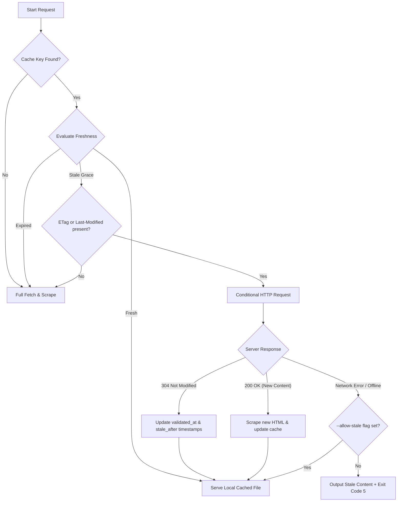

# Caching Protocol Specification

This document details the local caching protocol, storage paths, metadata schemas, freshness calculations, and revalidation behaviors used by Bonsai.

---

## 1. Storage Location & Directory Resolution

Cached research artifacts are saved as individual Markdown files (`<cache_key>.md`) under the directory resolved by Bonsai's oclif data directory (`this.config.dataDir`).

Depending on how the CLI is executed, the database path resolves as follows:
* **Standalone Bonsai CLI**: `~/.local/share/bonsai/research/` on Linux-style XDG systems, or the platform-specific oclif data directory for the `bonsai` binary.
* **Project-local Bonsai cache**: `<project>/.bonsai/research/` when `research config set storage project --local` is active.
* **OS-Specific Standards**:
  * **macOS**: `~/Library/Application Support/bonsai/research/`
  * **Linux**: `~/.local/share/bonsai/research/`
  * **Windows**: `%LOCALAPPDATA%\bonsai\research\`

Inside this folder, you will find:
1. **Durable Cache Files**: Named `<sha256_hash>.md`.
2. **Temporary/Scratch Files**: Created atomically under a `tmp` directory during writes to prevent file corruption.

### Read fallback (project → global)

When `storage` resolves to `project`, reads check the project cache first and then
fall back to the global cache. A cache key present in both locations is served from
the project copy. Writes go to the project cache, except as noted below.

### Secret-safety routing

The project cache is meant to be committed, so it must never hold credentials. Before
a write under `project` storage, the artifact's content is scanned for known secret
patterns (API keys, bearer/JWT tokens, private-key blocks, `secret=`/`token=`
assignments, etc.). On a match the artifact is **redirected to the global cache**, a
warning naming the credential *type* (never its value) is printed, and the JSON
envelope sets `redirectedToGlobal: true`. Global storage is not scanned, since it is
never committed.

---

## 2. URL Normalization & Cache Key Generation

To maximize cache hits across slightly different URL strings, every requested URL is normalized before resolving its cache key.

### URL Normalization Rules
1. **Scheme & Host**: Converted to lowercase.
2. **Trailing Slash**: Appended to root-level domain/path (e.g., `https://example.com` becomes `https://example.com/`).
3. **Hash Anchor Removal**: Fragments (e.g., `#section-1`) are removed.
4. **Stable Query Parameter Sorting**: Query parameters are sorted lexicographically by key. If a query parameter contains duplicate keys, they are sorted lexicographically by value.
5. **Port Sanitization**: Default HTTP (80) and HTTPS (443) ports are stripped.

### Cache Key Formula
The cache key is the **SHA-256 hash** of the normalized URL string representation:
```typescript
const cacheKey = crypto.createHash('sha256').update(normalizedUrl).digest('hex');
```

For imported multi-source synthesis files (which do not map to a single source URL), a unique hash is generated based on the custom topic and content body.

---

## 3. Stored Markdown File Format (YAML Frontmatter)

Every cache entry is stored as a single, human-readable Markdown file. This file contains a **YAML frontmatter** block at the beginning, followed by the content payloads.

### File Structure Example
```markdown
---
schema_version: 1
artifact_type: source
source_url: https://nodejs.org/api/url.html
source_urls:
  - https://nodejs.org/api/url.html
normalized_url: https://nodejs.org/api/url.html
cache_key: 0f115db062b7c0dd030b16878c99dea5c354b49dc37b38eb8846179c7783e9d7
topic: url-api
tags:
  - nodejs
  - url
format_available:
  - compressed
  - detailed
tier: standard
ttl: null
fetched_at: '2026-06-24T07:33:20.519Z'
validated_at: '2026-06-24T07:33:20.519Z'
stale_after: '2026-07-24T07:33:20.519Z'
capture_method: static_fetch
extraction_status: extracted
extraction_confidence: high
quality_notes:
  - readability extracted main article
etag: 'W/"5e-1736b7"'
last_modified: 'Wed, 24 Jun 2026 06:12:00 GMT'
content_hash: 7c5d321bb463ab06e78893d8b88...
token_estimate:
  compressed: 29
  detailed: 65
status: active
---

# Title of the Scraped Article

This section contains the Markdown representation. The file maintains both detailed and compressed variants separated by clean markdown headings if needed, or structured internally so the CLI parser can unpack them.
```

### Frontmatter Schema Specifications
* `schema_version`: (number) Currently `1`.
* `artifact_type`: (string) `source` (web scraped) or `research_note` (manually imported).
* `source_url`: (string) The primary source URL.
* `source_urls`: (array of strings) List of source URLs associated with this entry.
* `normalized_url`: (string) The normalized primary URL.
* `cache_key`: (string) Hex SHA-256 hash.
* `topic`: (string | null) User-defined topic/category classification.
* `tags`: (array of strings) Taxonomy tags.
* `format_available`: (array of strings) List containing `compressed` and/or `detailed`.
* `tier`: (string) The freshness tier: `stable`, `standard`, or `volatile`.
* `ttl`: (string | null) Custom lifetime duration string (e.g. `2h`, `7d`).
* `fetched_at`: (ISO string | null) Timestamp of the last successful network crawl.
* `validated_at`: (ISO string | null) Timestamp of the last freshness verification.
* `stale_after`: (ISO string | null) Timestamp when the fresh window expires.
* `capture_method`: (string | null) `static_fetch`, `browser_fallback`, or `agent_supplied`.
* `extraction_status`: (string | null) `extracted`, `agent_supplied`, or `failed`.
* `extraction_confidence`: (string | null) `high`, `medium`, or `low`.
* `quality_notes`: (array of strings) Informative tags about the scrape quality.
* `etag`: (string | null) HTTP response `ETag` header.
* `last_modified`: (string | null) HTTP response `Last-Modified` header.
* `content_hash`: (string) SHA-256 of the raw detailed Markdown.
* `token_estimate`: (object) Contains `{ compressed: number, detailed: number }` estimating the LLM token consumption.
* `status`: (string) `active` or `archived`.

---

## 4. Freshness Policy & Tiers

The cache computes freshness at lookup time by comparing `currentTime` against `validated_at` or `fetched_at` (whichever is more recent).

If no custom `--ttl` is provided on scrape/import, the freshness window is determined by the `--tier` flag:

| Tier | Fresh Window (TTL) | Grace Window (Stale Revalidation) | Description / Typical Target |
| --- | --- | --- | --- |
| `volatile` | **7 Days** | **5 Days** | Volatile APIs, changelogs, release notes, security feeds |
| `standard` | **30 Days** | **14 Days** | General developer documentation, libraries, guides |
| `stable` | **180 Days** | **60 Days** | Standards documents, RFCs, language specs (e.g., ECMA, HTML5) |

### Proportional Grace Calculation for Custom TTLs
When a custom `--ttl` string (e.g., `--ttl 24h` or `--ttl 90d`) is supplied:
1. The **Fresh Window** is set exactly to the parsed duration.
2. The **Grace Window** is calculated proportionally using the ratio of the base tier's grace-to-fresh window:
   $$\text{Grace Window} = \text{Parsed TTL} \times \left( \frac{\text{Default Tier Grace Window}}{\text{Default Tier Fresh Window}} \right)$$
   * For the default `standard` tier, the ratio is $\frac{14}{30} \approx 46.6\%$. A custom TTL of 10 days gets a grace window of 4.6 days.

---

## 5. Revalidation Flow (Conditional Requests)

When a lookup falls inside the **Grace Window** (status: `stale_grace`), the CLI attempts to revalidate the cache instead of performing a heavy full download.



### Conditional HTTP Headers
If the stored frontmatter contains `etag` or `last_modified`:
* `If-None-Match` is populated with `etag`.
* `If-Modified-Since` is populated with `last_modified`.

If the server returns `304 Not Modified`:
* The local cache file is touched.
* The `validated_at` timestamp is updated to the current time.
* The `stale_after` timestamp is recalculated and extended.
* The command avoids downloading, parsing, and converting any body payload, making it an extremely cheap verification.

---

## 6. Offline Fallback & Stale Serving Policies

If revalidation fails due to a network connection timeout, DNS failure, or target server crash:

1. **Inside Grace Window (`stale_grace`)**:
   * If `--allow-stale` is **active**: The CLI serves the cached note and exits normally (exit code `0`).
   * If `--allow-stale` is **inactive**: The CLI serves the cached note to avoid blocking the caller, but exits with **Exit Code 5** to notify the system that the content is stale and could not be verified. Warning logs are printed to `stderr`.
2. **Expired (`stale_expired`)**:
   * Stale content beyond the grace window is considered dead. The CLI will attempt a full fetch. If the fetch fails, it throws a connection error and exits with **Exit Code 1**.
